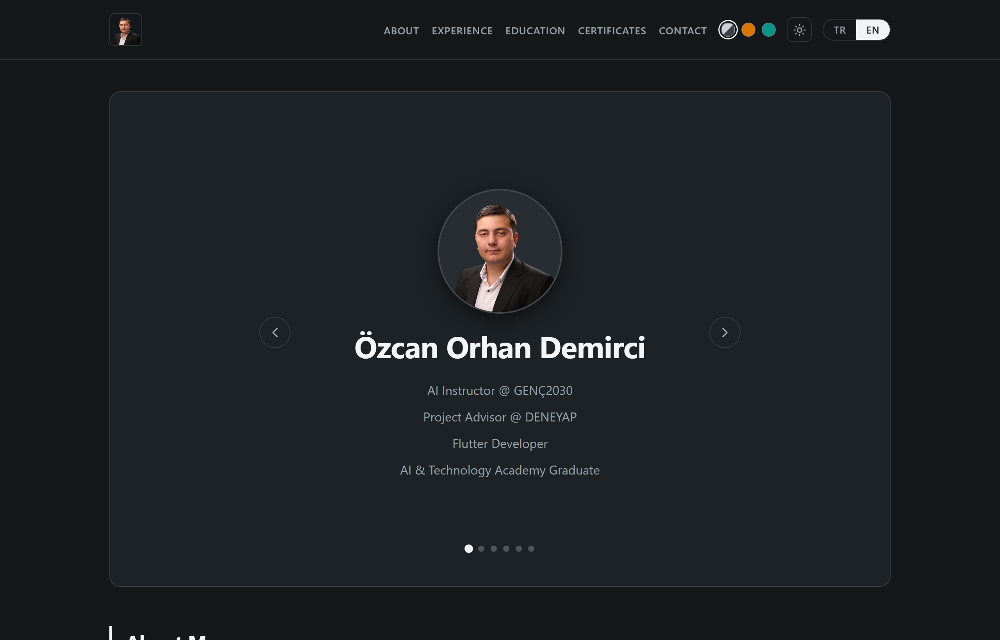
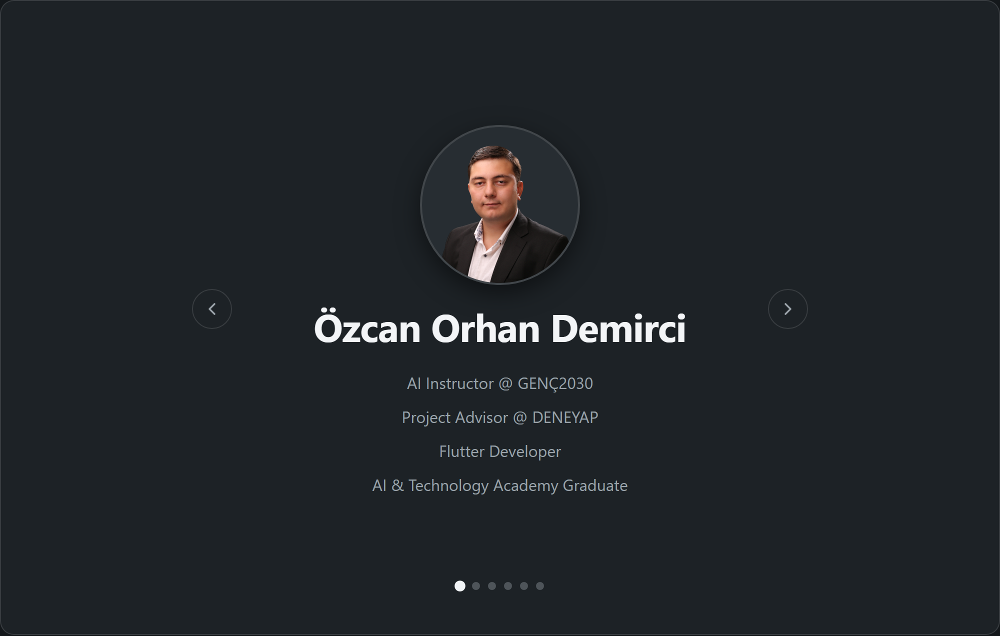
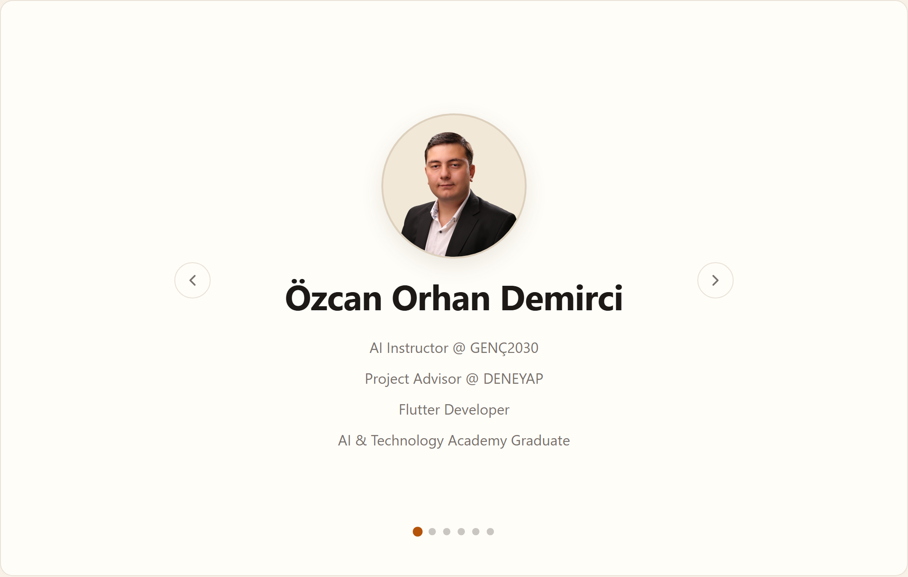
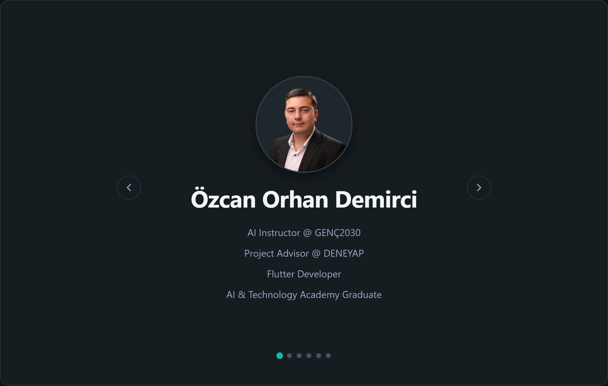
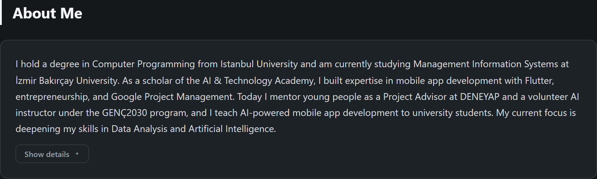
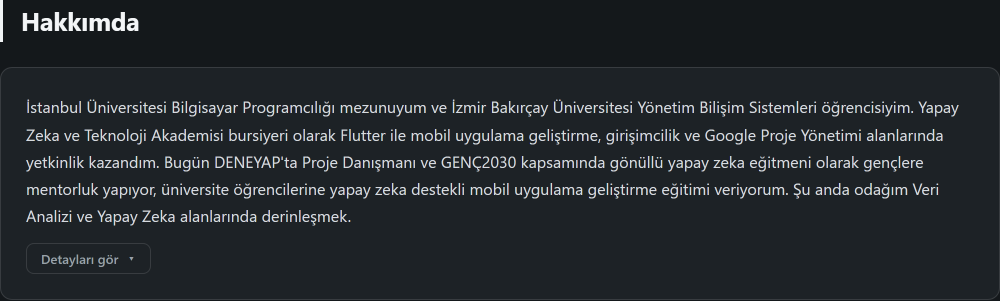
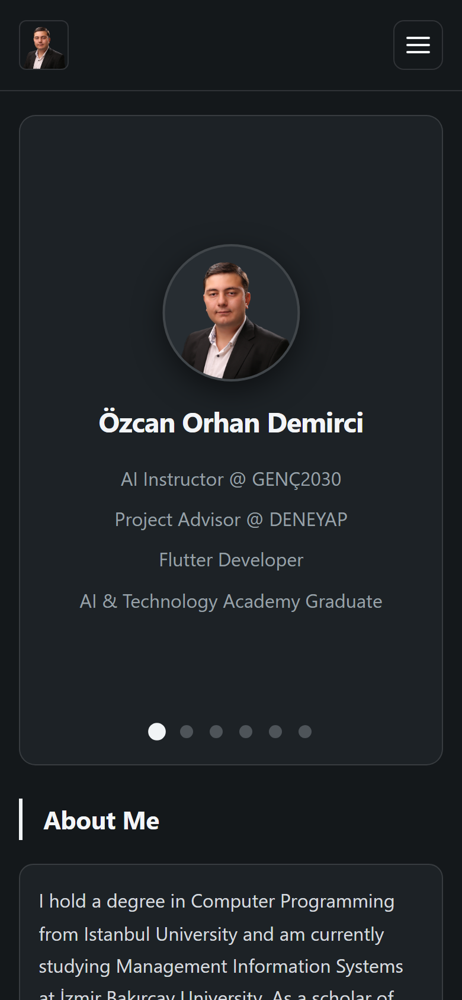
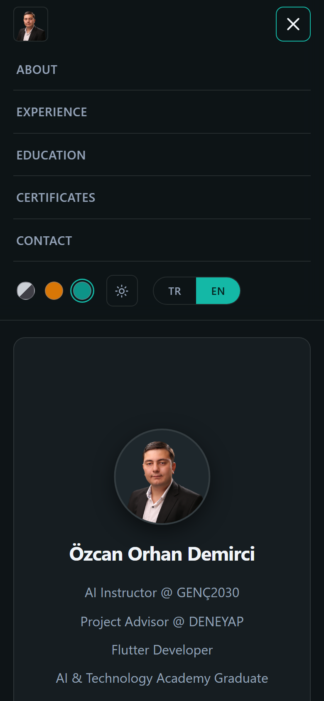
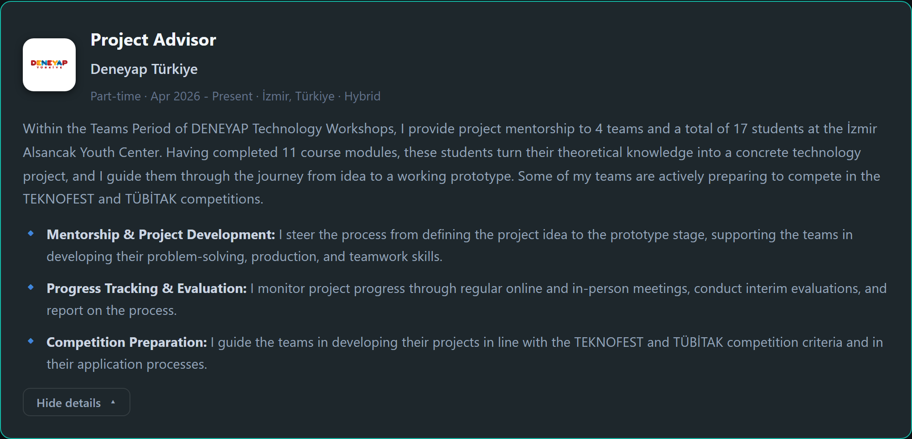
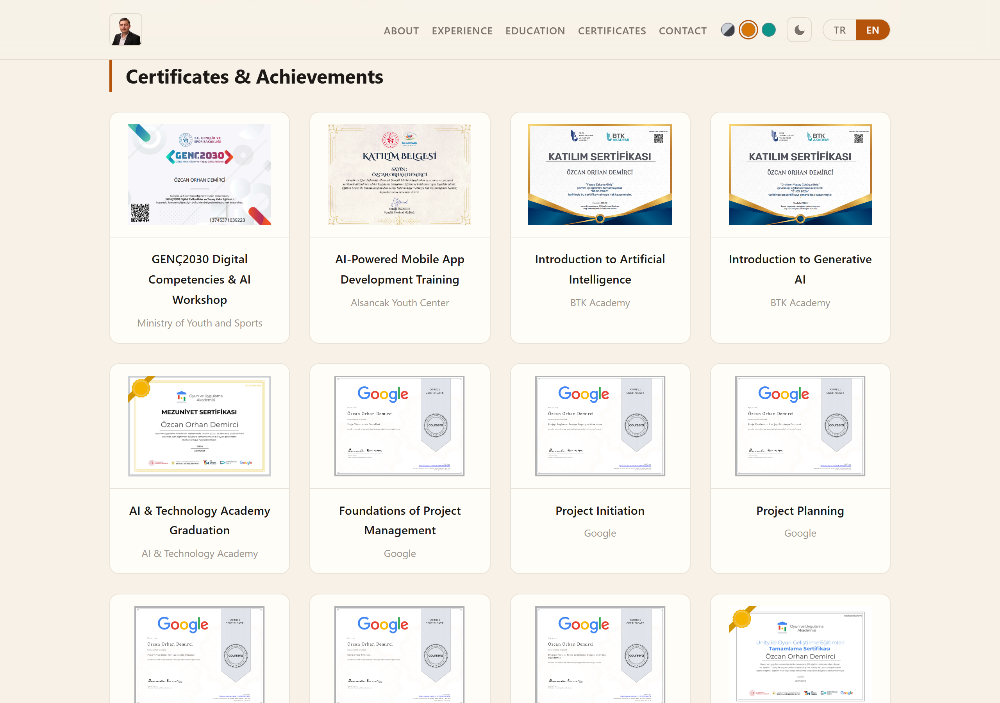

<a id="top"></a>

<div align="center">

<!-- ============================ BANNER ============================ -->

# Özcan Orhan Demirci

### 🤖 AI Instructor &nbsp;·&nbsp; 🧭 Project Advisor &nbsp;·&nbsp; 📱 Flutter Developer

**A bilingual (TR / EN), six-theme, dependency-free single-page portfolio, and a living résumé.**
<br>
**İki dilli (TR / EN), altı temalı, sıfır bağımlılıklı tek sayfalık portfolyo ve yaşayan bir özgeçmiş.**

<br>

<!-- Tech -->


<!-- Qualities -->


<br>

### [&nbsp; ▶ &nbsp; **View the Live Site** &nbsp; / &nbsp; **Canlı Siteyi Gör** &nbsp;](https://ozcanorhandemirci.github.io/Portfolio-Web-Project/)

[](https://www.linkedin.com/in/ozcan-orhan-demirci/)
[](https://github.com/OzcanOrhanDemirci)
[](mailto:ozcanorhandemirci@gmail.com)

<br>

**🌍 Read in your language &nbsp;/&nbsp; Dilini seç:** &nbsp; [**English**](#lang-en) &nbsp;•&nbsp; [**Türkçe**](#lang-tr)

<br>

<!-- ============================ HERO ============================ -->



<br><br>

🎓 **2 Universities** &nbsp;·&nbsp; 💼 **8 Roles / 5 Organizations** &nbsp;·&nbsp; 📜 **29 Certificates** &nbsp;·&nbsp; 🧑‍🏫 **1 of 500 National GENÇ2030 AI Instructors** &nbsp;·&nbsp; 📱 **8 Student Apps Shipped**

</div>

---

## ✨ Showcase &nbsp;/&nbsp; Önizleme

> **Adaptive theming: one source of truth, six looks.** &nbsp;·&nbsp; *Uyarlanır temalar: tek kaynak, altı görünüm.*
> Every colour flows through CSS custom properties, so all **3 palettes × 2 (light / dark) modes** render from a single system. The choice is auto-detected from the OS and remembered across visits.

<table>
  <tr>
    <td align="center" width="33%"><br><sub><b>Neutral · Dark</b></sub></td>
    <td align="center" width="33%"><br><sub><b>Warm · Light</b></sub></td>
    <td align="center" width="33%"><br><sub><b>Cool · Dark</b></sub></td>
  </tr>
</table>

> **Fully bilingual: Turkish & English, instantly.** &nbsp;·&nbsp; *Tamamen iki dilli: Türkçe & İngilizce, anında.*
> Both languages are authored inline; a single toggle swaps the entire page, the document title included. First-time visitors get their browser language automatically.

<table>
  <tr>
    <td align="center" width="50%"><br><sub><b>English</b></sub></td>
    <td align="center" width="50%"><br><sub><b>Türkçe</b></sub></td>
  </tr>
</table>

> **Responsive to every screen, and accessible.** &nbsp;·&nbsp; *Her ekrana uyumlu ve erişilebilir.*
> A mobile-first layout reflows across four breakpoints, with a hamburger menu that carries the full appearance & language controls. Rich content (expandable experience cards, a 29-item certificate gallery) stays tidy on a phone.

<table>
  <tr>
    <td align="center" width="25%"><br><sub><b>📱 Mobile landing</b></sub></td>
    <td align="center" width="25%"><br><sub><b>📱 Menu &amp; controls</b></sub></td>
    <td align="center" width="50%"><br><sub><b>💼 Expandable experience cards</b></sub></td>
  </tr>
</table>

<div align="center"><br><sub><b>📜 Certificate gallery: click any card for a full-screen lightbox</b></sub></div>

---

<!-- ============================================================ -->
<!-- ============================ ENGLISH ====================== -->
<!-- ============================================================ -->

<a id="lang-en"></a>

## English

> **In one minute:** This repository is the source of my personal portfolio: a single-page, fully responsive site built with **vanilla HTML, CSS and JavaScript** (no frameworks, no build step, zero dependencies). It is also a digital CV: below you can read who I am, what I have done, and exactly how the site is engineered, without ever opening it.

**Navigate:** [About Me](#en-about) · [Experience](#en-experience) · [Education](#en-education) · [Certifications](#en-certs) · [The Project](#en-project) · [Tech & Engineering](#en-tech) · [Project Structure](#en-structure) · [Run Locally](#en-run) · [Contact](#en-contact)

<a id="en-about"></a>
### About Me

I hold a degree in **Computer Programming from Istanbul University** and am currently studying **Management Information Systems at İzmir Bakırçay University** (100% English). As a scholar of the **AI & Technology Academy** (selected among thousands of applicants), I built expertise in mobile app development with **Flutter**, entrepreneurship, and **Google Project Management** (six internationally recognised Coursera certificates).

Today I carry those technical and managerial skills into educator and mentor roles. I mentor young people as a **Project Advisor at DENEYAP**, serve as a **volunteer AI instructor under the Ministry of Youth and Sports' GENÇ2030 program** (one of 500 instructors selected nationwide), and I have taught **AI-powered mobile app development** to university students. I follow industry trends closely and regularly attend events such as **Google DevFest**. My current focus is deepening my skills in **Data Analysis and Artificial Intelligence**.

- 💻 **Technical interests:** Mobile App Development · Data Analysis · Artificial Intelligence
- 📈 **Personal interests:** Following and analysing financial markets
- 🌊 **Hobbies:** Swimming and exploring the underwater world (diving)

<a id="en-experience"></a>
### Experience

#### 🧭 Project Advisor at *Deneyap Türkiye*
`Part-time · Apr 2026 - Present · İzmir, Türkiye · Hybrid`

Within the Teams Period of DENEYAP Technology Workshops, I provide project mentorship to **4 teams and a total of 17 students** at the İzmir Alsancak Youth Center. Having completed 11 course modules, these students turn theory into a concrete technology project, and some are actively preparing to compete in **TEKNOFEST** and **TÜBİTAK**.

<details><summary><i>Show details</i></summary>

- **Mentorship & Project Development:** I steer the process from defining the idea to the prototype stage, supporting problem-solving, production and teamwork skills.
- **Progress Tracking & Evaluation:** I monitor progress through regular online and in-person meetings, run interim evaluations and report on the process.
- **Competition Preparation:** I guide teams to align their projects with TEKNOFEST and TÜBİTAK criteria and through the application process.
</details>

#### 🤖 Volunteer Instructor at *Republic of Türkiye, Ministry of Youth and Sports (GENÇ2030)*
`Part-time · Feb 2026 - Present · Türkiye · Hybrid`

Selected among **500 volunteer instructors nationwide**, I earned the authorisation to deliver AI training at youth centers across **all 81 provinces** of Türkiye, conveying AI literacy to a wide audience from middle school to university.

<details><summary><i>Show details</i></summary>

- **Selection & Authorisation:** Accredited as a national instructor after the *"Digital Competencies and Artificial Intelligence Workshop"* at the Ministry's headquarters in Ankara, as part of the 7-person team representing the İzmir Alsancak Youth Center.
- **Field Training:** Met with young people across provinces and districts, including an AI conference with **hundreds of high-school students in Menemen**.
- **Topics covered:** AI fundamentals (Narrow AI, AGI, superintelligence); LLM platforms (ChatGPT, Claude, Gemini); source-grounded research with NotebookLM; AI ethics & safety (hallucination, deepfakes); the Vibe Coding methodology; game design with Google AI Studio; and web app development with Antigravity.
</details>

#### 🧑‍🏫 Instructor & Trainee at *İzmir Alsancak Youth Center (R&D)*
`Part-time · 5 mos · İzmir, Türkiye · On-site`

**Instructor** *(Mar 2026 - May 2026)*. I taught the **"AI-Powered Mobile Application Development Course."** Over 12 weeks, university students went from a blank screen to a store-ready app, integrating AI at every stage. By the end, **my students had built 8 mobile applications**.

<details><summary><i>Show details</i></summary>

- **Development & Design:** Flutter, Android Studio, Git and emulator setup; wireframes, grids, typography and colour in Figma; Agile/Scrum, MVP and user journey.
- **AI Production Loop:** an 8-step flow from idea to code, covering screen design with Stitch, conversion to Flutter/Dart with Antigravity, and testing on the emulator.
- **Backend & Security:** Firebase (Auth, Firestore, Analytics, App Check) and Supabase; API integration, JSON, HTTP methods, `.env`, and the Zero Trust approach.
- **Publishing & Monetization:** App Store / Google Play processes, IAP and subscription models, open-source licenses, KVKK / GDPR.
- **Capstone:** a Firebase-backed chatbot built on Google's open-source **Gemma** model via API.
</details>

**Trainee** *(Jan 2026 - Mar 2026)*. I first completed the same 12-week course as a participant, building and publishing my own mobile application to graduate the program.

#### 🎮 Graduate · Scrum Master · Trainee at *AI & Technology Academy*
`9 mos · Remote`

A 9-month journey through the academy: comprehensive training, a project-management certification, and a closing bootcamp.

<details><summary><i>Show details</i></summary>

- **Graduate** *(Jul 2023 - Aug 2023)*. Graduated after completing the technical training, the project-management certification and the bootcamp.
- **Scrum Master & Unity-C# Developer** *(Jun 2023 - Jul 2023)*. In the **Unity-108** bootcamp team: developed the game in Unity/C#, managed delivery with Trello, ran daily stand-ups, retrospectives and sprint reviews, and kept the GitHub repository under version control each sprint, gaining hands-on experience in motivation, scheduling and risk management.
- **Trainee** *(Dec 2022 - Jun 2023)*. Comprehensive training across **Mobile Development** (Flutter, UI/UX, Dart), **Project Management** (Google PM International Certificate on Coursera, 6 modules), **Entrepreneurship** (tech entrepreneurship, Business Model Canvas, presentation), **Game Development** (Unity & C#) and **Version Control** (Git & GitHub).
</details>

#### 🕹️ Game Designer at *Good Game Design Folks*
`Freelance · Dec 2022 - Jul 2023 · Pendik, İstanbul, Türkiye · Remote`

As a freelance game designer, I contributed to projects across game development and game design.

<a id="en-education"></a>
### Education

| Institution | Degree | Notes |
| :--- | :--- | :--- |
| **İzmir Bakırçay University** | Bachelor's in Management Information Systems | 100% English · Active in IEEE Bakırçay, GDGC, GDSC, the AI, MIS & Engineering communities |
| **Istanbul University** | Associate's in Computer Programming | Faculty of Open and Distance Education |

<a id="en-certs"></a>
### Certifications & Achievements

**29 certificates** spanning AI, project management, mobile development, entrepreneurship and finance:

| Issuer | Certificates |
| :--- | :--- |
| **Google** (Coursera) | Google Project Management Professional Certificate: *Foundations · Initiation · Planning · Execution · Agile · Capstone* (6) |
| **AI & Technology Academy** | Graduation · Unity Game Development · Ideathon · Technology Entrepreneurship · English for Developers (5) |
| **TalentCoders** | Applied AI Training · TechCamp · TechCamp 2 · Code Sprint (4) |
| **BTK Academy** | Introduction to AI · Introduction to Generative AI · Version Control: Git & GitHub (3) |
| **SPL** (Capital Markets Licensing) | Financial Literacy: Levels 1, 2 & 3 (3) |
| **Bakırçay University** | Magic Systems Day · MIS Days · Occupational Health & Safety (3) |
| **Ministry of Youth & Sports** | GENÇ2030 Digital Competencies & AI Workshop (1) |
| **Alsancak Youth Center** | AI-Powered Mobile App Development Training (1) |
| **IEEE IDU & İzQ** | Hackability Hackathon (1) |
| **TÜSİAD** | Entrepreneurship 101 (1) |
| **Etkin Kampüs** | Canva Career Summit (1) |

> All 29 certificates are viewable as a clickable gallery on the [live site](https://ozcanorhandemirci.github.io/Portfolio-Web-Project/#certificates).

<a id="en-project"></a>
### 🚀 About This Project

This portfolio is a **single-page static site**, intentionally built with **no framework and no build step** so it is fast, transparent and trivial to host. Everything ships as three hand-written files plus assets.

**Feature highlights**

- 🌐 **Bilingual (TR / EN):** full Turkish & English copy authored inline as paired `data-lang` nodes. One toggle swaps the whole page (and the `<title>`); the visitor's browser language is auto-detected on first visit and the choice is remembered.
- 🎨 **Six-way theming:** three palettes (**Neutral**, **Warm** stone+amber, **Cool** slate+teal) × **light / dark** mode. All colours derive from CSS custom properties, the initial mode follows the OS `prefers-color-scheme`, and the browser UI tint (`theme-color`) updates to match.
- ⚡ **No flash of unstyled content:** a tiny inline script applies the saved/auto language, palette and mode **before first paint**.
- 🎠 **Accessible hero carousel:** roles & affiliations on an infinite loop (cloned edge slides) with autoplay that pauses on hover/focus, prev/next arrows, dot navigation, **keyboard** arrows and **touch swipe**, all respecting `prefers-reduced-motion`.
- 🪗 **Smooth expand/collapse:** About and every Experience card grow and shrink with a pure-CSS `grid-template-rows` `0fr → 1fr` animation, wired with correct `aria-expanded` state.
- 📱 **Responsive & mobile-first:** fluid type and spacing via `clamp()`, four structural breakpoints (860 / 768 / 600 / 400) plus landscape & touch refinements; the nav collapses into an accessible hamburger.
- 🖼️ **Modals:** a full-screen certificate lightbox and a contact modal that reveals the email on demand (dismiss by backdrop click or `Esc`).
- ♿ **Accessibility-minded:** semantic HTML, ARIA roles/labels, `aria-pressed/expanded/current`, visible focus rings, descriptive `alt` text and reduced-motion support throughout.
- 📲 **PWA-ready & SEO-aware:** web manifest, a complete favicon set, `theme-color`, a meta description and a localized document title.

<a id="en-tech"></a>
### 🛠️ Tech Stack & Engineering Highlights

<p>
  
  
  
  
  
</p>

The build is deliberately minimal; the **engineering is where the care shows**:

- **Strict separation of concerns:** `index.html` is content only, `styles.css` is all presentation, `script.js` is all behaviour. Each file opens with a documented section map.
- **A single theming source of truth:** six theme/mode combinations are produced by swapping CSS custom properties on `html[data-theme][data-mode]`; every rule consumes the variables, so nothing is themed twice.
- **Framework-free i18n:** one root class (`lang-tr` / `lang-en`) shows exactly one language; no runtime string lookups, no dependencies.
- **Pre-paint state hydration:** language, palette and mode are restored before the body renders, eliminating FOUC without a framework.
- **Modern CSS motion:** collapsible sections animate height via `grid-template-rows` (no JS measuring), and all motion is gated behind `prefers-reduced-motion`.
- **Progressive enhancement & performance:** JavaScript is `defer`-loaded inside one strict-mode IIFE; images are `loading="lazy"` + `decoding="async"`; there is no render-blocking JS and nothing to install.
- **Verified responsiveness:** a **Playwright** harness screenshots the site across **10 device widths** and runs a programmatic horizontal-overflow audit, so "responsive" is tested, not assumed. *(The showcase images above were produced by that same automated harness.)*

<a id="en-structure"></a>
### 📂 Project Structure

```text
Portfolio-Web-Project/
├── index.html              # Semantic content only (structure)
├── styles.css              # All presentation: theming, layout, responsive tiers
├── script.js               # All interactivity (deferred, single IIFE)
├── README.md               # You are here
├── LICENSE                 # MIT
├── docs/
│   └── screenshots/        # Showcase images used by this README
└── img/
    ├── favicon/            # Favicons + web app manifest
    ├── logo/               # Profile photo & institution logos
    └── certificates/       # Certificate images
```

<a id="en-run"></a>
### ▶ Run It Locally

No dependencies, no build. Clone and open.

```bash
git clone https://github.com/OzcanOrhanDemirci/Portfolio-Web-Project.git
cd Portfolio-Web-Project

# Easiest: open index.html directly in a browser.
# Recommended (so relative paths & localStorage behave exactly like production):
python -m http.server 8000        # then visit http://127.0.0.1:8000
# or:  npx serve .
```

<a id="en-contact"></a>
### 📬 Contact

- 💼 **LinkedIn:** [ozcan-orhan-demirci](https://www.linkedin.com/in/ozcan-orhan-demirci/)
- 💻 **GitHub:** [OzcanOrhanDemirci](https://github.com/OzcanOrhanDemirci)
- 📧 **Email:** [ozcanorhandemirci@gmail.com](mailto:ozcanorhandemirci@gmail.com)

<div align="right"><a href="#top">⬆ Back to top</a></div>

---

<!-- ============================================================ -->
<!-- ============================ TÜRKÇE ======================= -->
<!-- ============================================================ -->

<a id="lang-tr"></a>

## Türkçe

> **Bir dakikada:** Bu depo, kişisel portfolyo sitemin kaynağıdır: **saf HTML, CSS ve JavaScript** ile geliştirilmiş (çerçeve yok, derleme adımı yok, sıfır bağımlılık), tamamen responsive tek sayfalık bir site. Aynı zamanda dijital bir özgeçmiştir: aşağıda kim olduğumu, neler yaptığımı ve sitenin nasıl kurgulandığını, siteyi hiç açmadan, okuyabilirsiniz.

**Gezin:** [Hakkımda](#tr-about) · [Deneyim](#tr-experience) · [Eğitim](#tr-education) · [Sertifikalar](#tr-certs) · [Proje](#tr-project) · [Teknoloji & Mühendislik](#tr-tech) · [Proje Yapısı](#tr-structure) · [Yerelde Çalıştır](#tr-run) · [İletişim](#tr-contact)

<a id="tr-about"></a>
### Hakkımda

**İstanbul Üniversitesi Bilgisayar Programcılığı mezunuyum** ve şu an **İzmir Bakırçay Üniversitesi Yönetim Bilişim Sistemleri** bölümünde (%100 İngilizce) eğitimime devam ediyorum. Binlerce başvuru arasından seçilerek **Yapay Zeka ve Teknoloji Akademisi** bursiyeri oldum; bu süreçte **Flutter** ile mobil uygulama geliştirme, girişimcilik ve **Google Proje Yönetimi** (Coursera üzerinden uluslararası geçerli altı sertifika) alanlarında yetkinlik kazandım.

Bugün bu teknik ve yönetimsel yetkinlikleri eğitmenlik ve mentorluk rollerine taşıyorum. **DENEYAP'ta Proje Danışmanı** olarak gençlere mentorluk yapıyor, **Gençlik ve Spor Bakanlığı'nın GENÇ2030 programı** kapsamında (Türkiye genelinde seçilen 500 gönüllü eğitmenden biri olarak) gönüllü yapay zeka eğitmenliği veriyor ve üniversite öğrencilerine **yapay zeka destekli mobil uygulama geliştirme** eğitimi verdim. Sektör trendlerini yakından takip ediyor, **Google DevFest** gibi etkinliklere düzenli katılıyorum. Şu anki odağım **Veri Analizi ve Yapay Zeka** alanlarında derinleşmek.

- 💻 **Teknik ilgi alanları:** Mobil Uygulama Geliştirme · Veri Analizi · Yapay Zeka
- 📈 **Kişisel ilgi alanları:** Finansal piyasaların takibi ve analizi
- 🌊 **Hobi:** Yüzme ve su altı dünyasını keşfetmek (dalış)

<a id="tr-experience"></a>
### Deneyim

#### 🧭 Proje Danışmanı, *Deneyap Türkiye*
`Yarı zamanlı · Nis 2026 - Devam ediyor · İzmir, Türkiye · Hibrit`

DENEYAP Teknoloji Atölyeleri'nin Takımlar Dönemi kapsamında, İzmir Alsancak Gençlik Merkezi'nde **4 takıma ve toplam 17 öğrenciye** proje danışmanlığı yapıyorum. 11 ders başlığını tamamlayan bu öğrenciler teoriyi somut bir teknoloji projesine dönüştürüyor; bir kısmı **TEKNOFEST** ve **TÜBİTAK** yarışmalarına fiilen hazırlanıyor.

<details><summary><i>Detayları gör</i></summary>

- **Mentorluk & Proje Geliştirme:** Fikir aşamasından prototipe kadar süreci yönlendiriyor; problem çözme, üretim ve takım çalışması becerilerini destekliyorum.
- **Süreç Takibi & Değerlendirme:** Düzenli çevrimiçi ve yüz yüze toplantılarla ilerlemeyi izliyor, ara değerlendirmeler yapıyor ve süreci raporluyorum.
- **Yarışmaya Hazırlık:** Takımları TEKNOFEST ve TÜBİTAK kriterlerine uygun şekilde ve başvuru süreçlerinde yönlendiriyorum.
</details>

#### 🤖 Gönüllü Eğitmen, *T.C. Gençlik ve Spor Bakanlığı (GENÇ2030)*
`Yarı zamanlı · Şub 2026 - Devam ediyor · Türkiye · Hibrit`

Türkiye genelinde seçilen **500 gönüllü eğitmen** arasına girerek **81 ildeki** gençlik merkezlerinde yapay zeka eğitimi verme yetkisi kazandım; ortaokuldan üniversiteye uzanan geniş bir kitleye yapay zeka okuryazarlığını aktarıyorum.

<details><summary><i>Detayları gör</i></summary>

- **Seçilme & Yetkilendirme:** Ankara'da Bakanlık merkez binasındaki *"Dijital Yetkinlikler ve Yapay Zeka Atölyesi"*ne, İzmir Alsancak Gençlik Merkezi'ni temsil eden 7 kişilik ekipte katılarak ulusal düzeyde eğitmen olarak yetkilendirildim.
- **Sahada Eğitim:** Farklı il ve ilçelerde gençlerle bir araya geldim; **Menemen'de yüzlerce lise öğrencisiyle** gerçekleştirdiğimiz yapay zeka konferansı dahil.
- **İşlediğim başlıklar:** Yapay zeka temelleri (Dar YZ, AGI, süper zeka); büyük dil modeli platformları (ChatGPT, Claude, Gemini); NotebookLM ile kaynak odaklı araştırma; yapay zeka etiği ve güvenliği (halüsinasyon, deepfake); Vibe Coding metodolojisi; Google AI Studio ile oyun tasarımı; Antigravity ile web uygulaması geliştirme.
</details>

#### 🧑‍🏫 Eğitmen & Kursiyer, *İzmir Alsancak Gençlik Merkezi (ARGE)*
`Yarı zamanlı · 5 ay · İzmir, Türkiye · Ofiste`

**Eğitmen** *(Mar 2026 - May 2026)*. **"Yapay Zeka Destekli Mobil Uygulama Geliştirme Kursu"**nun eğitmenliğini üstlendim. 12 hafta boyunca üniversite öğrencileriyle boş bir ekrandan mağazaya hazır uygulamaya uzandık; her aşamada yapay zekayı işin içine kattık. Süreç sonunda **öğrencilerim 8 mobil uygulama geliştirdi**.

<details><summary><i>Detayları gör</i></summary>

- **Geliştirme & Tasarım:** Flutter, Android Studio, Git ve emülatör kurulumu; Figma ile wireframe, grid, tipografi ve renk; Agile/Scrum, MVP ve kullanıcı yolculuğu.
- **Yapay Zeka Üretim Döngüsü:** Fikirden koda 8 adımlık akış; Stitch ile ekran tasarımı, Antigravity ile Flutter/Dart'a dönüşüm, emülatörde test.
- **Backend & Güvenlik:** Firebase (Auth, Firestore, Analytics, App Check) ve Supabase; API entegrasyonu, JSON, HTTP metotları, `.env` ve Zero Trust yaklaşımı.
- **Yayınlama & Monetizasyon:** App Store / Google Play süreçleri, IAP ve abonelik modelleri, açık kaynak lisansları, KVKK / GDPR.
- **Bitirme Projesi:** Google'ın açık kaynak modeli **Gemma**'yı API üzerinden kullanan, Firebase destekli bir chatbot.
</details>

**Kursiyer** *(Oca 2026 - Mar 2026)*. Aynı 12 haftalık kursu önce katılımcı olarak tamamladım; kendi mobil uygulamamı geliştirip yayınlayarak programı bitirdim.

#### 🎮 Mezun · Scrum Master · Kursiyer, *Yapay Zeka ve Teknoloji Akademisi*
`9 ay · Uzaktan`

Akademide 9 aylık bir yolculuk: kapsamlı eğitim, proje yönetimi sertifikasyonu ve kapanış bootcamp'i.

<details><summary><i>Detayları gör</i></summary>

- **Mezun** *(Tem 2023 - Ağu 2023)*. Teknik eğitimleri, proje yönetimi sertifikasyonunu ve bootcamp'i tamamlayarak mezun oldum.
- **Scrum Master & Unity-C# Developer** *(Haz 2023 - Tem 2023)*. **Unity-108** bootcamp takımında: oyunu Unity/C# ile geliştirdim, süreci Trello ile yönettim, günlük toplantılar, retrospektifler ve sprint incelemeleri yürüttüm, her sprint sonunda GitHub deposunu güncel tuttum; motivasyon, zamanlama ve risk yönetiminde tecrübe kazandım.
- **Kursiyer** *(Ara 2022 - Haz 2023)*. **Mobil Geliştirme** (Flutter, UI/UX, Dart), **Proje Yönetimi** (Google PM Uluslararası Sertifikası, Coursera, 6 modül), **Girişimcilik** (teknoloji girişimciliği, İş Modeli Kanvası, sunum), **Oyun Geliştirme** (Unity & C#) ve **Versiyon Kontrol** (Git & GitHub) alanlarında kapsamlı eğitim.
</details>

#### 🕹️ Game Designer, *Good Game Design Folks*
`Serbest çalışan · Ara 2022 - Tem 2023 · Pendik, İstanbul, Türkiye · Uzaktan`

Serbest oyun tasarımcısı olarak oyun geliştirme ve oyun tasarımı projelerinde yer aldım.

<a id="tr-education"></a>
### Eğitim

| Kurum | Derece | Notlar |
| :--- | :--- | :--- |
| **İzmir Bakırçay Üniversitesi** | Lisans, Yönetim Bilişim Sistemleri | %100 İngilizce · IEEE Bakırçay, GDGC, GDSC, YZ, YBS ve Mühendislik topluluklarında aktif |
| **İstanbul Üniversitesi** | Ön Lisans, Bilgisayar Programcılığı | Açık ve Uzaktan Eğitim Fakültesi |

<a id="tr-certs"></a>
### Sertifikalar & Başarılar

Yapay zeka, proje yönetimi, mobil geliştirme, girişimcilik ve finans alanlarında **29 sertifika**:

| Veren Kurum | Sertifikalar |
| :--- | :--- |
| **Google** (Coursera) | Google Proje Yönetimi Profesyonel Sertifikası: *Temeller · Başlatma · Planlama · Yürütme · Çevik · Bitirme* (6) |
| **Yapay Zeka ve Teknoloji Akademisi** | Mezuniyet · Unity ile Oyun Geliştirme · Ideathon · Teknoloji Girişimciliği · Yazılımcılar İçin İngilizce (5) |
| **TalentCoders** | Uygulamalı Yapay Zeka Eğitimi · TechCamp · TechCamp 2 · Code Sprint (4) |
| **BTK Akademi** | Yapay Zekaya Giriş · Üretken Yapay Zekaya Giriş · Versiyon Kontrol: Git & GitHub (3) |
| **SPL** (Sermaye Piyasası Lisanslama) | Finansal Okuryazarlık: Seviye 1, 2 & 3 (3) |
| **Bakırçay Üniversitesi** | Sihirli Sistemler Günü · YBS Günleri · İş Sağlığı ve Güvenliği (3) |
| **Gençlik ve Spor Bakanlığı** | GENÇ2030 Dijital Yetkinlikler & YZ Atölyesi (1) |
| **Alsancak Gençlik Merkezi** | Yapay Zeka Destekli Mobil Uygulama Geliştirme Eğitimi (1) |
| **IEEE İDÜ & İzQ** | Hackability Hackathon (1) |
| **TÜSİAD** | Girişimcilik 101 (1) |
| **Etkin Kampüs** | Canva Kariyer Zirvesi (1) |

> 29 sertifikanın tamamı [canlı sitede](https://ozcanorhandemirci.github.io/Portfolio-Web-Project/#certificates) tıklanabilir bir galeride görüntülenebilir.

<a id="tr-project"></a>
### 🚀 Proje Hakkında

Bu portfolyo, **tek sayfalık statik bir sitedir**; hızlı, şeffaf ve barındırması kolay olsun diye bilinçli olarak **çerçevesiz ve derleme adımsız** geliştirildi. Her şey, elle yazılmış üç dosya ve birkaç varlıktan ibaret.

**Öne çıkan özellikler**

- 🌐 **İki dilli (TR / EN):** Türkçe ve İngilizce metinler, eşleştirilmiş `data-lang` düğümleri olarak satır içinde yazıldı. Tek bir düğme tüm sayfayı (ve `<title>`'ı) değiştirir; ziyaretçinin tarayıcı dili ilk girişte otomatik algılanır ve tercih hatırlanır.
- 🎨 **Altı yönlü tema:** üç palet (**Nötr**, **Sıcak** taş+kehribar, **Soğuk** arduvaz+deniz mavisi) × **açık / koyu** mod. Tüm renkler CSS custom property'lerden türetilir, başlangıç modu işletim sisteminin `prefers-color-scheme` tercihini izler ve tarayıcı arayüz rengi (`theme-color`) buna uyum sağlar.
- ⚡ **Stilsiz içerik parlaması yok (FOUC):** küçük bir satır içi script, kayıtlı/otomatik dil, palet ve modu **ilk boyamadan önce** uygular.
- 🎠 **Erişilebilir hero carousel:** roller ve kurumlar sonsuz döngüde (kenar slaytları klonlanmış); üzerine gelince/odaklanınca duraklayan otomatik oynatma, ileri/geri okları, nokta navigasyonu, **klavye** okları ve **dokunmatik kaydırma**, tümü `prefers-reduced-motion`'a saygılı.
- 🪗 **Akıcı aç/kapa:** Hakkımda ve her Deneyim kartı, saf CSS `grid-template-rows` `0fr → 1fr` animasyonuyla büyüyüp küçülür; doğru `aria-expanded` durumuyla.
- 📱 **Responsive & mobil öncelikli:** `clamp()` ile akışkan tipografi ve boşluk, dört yapısal kırılım noktası (860 / 768 / 600 / 400) ve yatay/dokunmatik iyileştirmeleri; navigasyon erişilebilir bir hamburger menüye dönüşür.
- 🖼️ **Modaller:** tam ekran sertifika lightbox'ı ve e-postayı talep üzerine gösteren iletişim modalı (arka plana tıklayarak veya `Esc` ile kapanır).
- ♿ **Erişilebilirlik odaklı:** anlamlı HTML, ARIA rolleri/etiketleri, `aria-pressed/expanded/current`, görünür odak halkaları, açıklayıcı `alt` metinleri ve azaltılmış hareket desteği.
- 📲 **PWA'ya hazır & SEO uyumlu:** web manifest, eksiksiz favicon seti, `theme-color`, meta açıklama ve yerelleştirilmiş sayfa başlığı.

<a id="tr-tech"></a>
### 🛠️ Teknoloji & Mühendislik

<p>
  
  
  
  
  
</p>

Kurulum bilinçli olarak minimal; **özen, mühendislikte kendini gösteriyor**:

- **Katı sorumluluk ayrımı:** `index.html` yalnızca içerik, `styles.css` tüm sunum, `script.js` tüm davranış. Her dosya, belgelenmiş bir bölüm haritasıyla açılır.
- **Tek bir tema kaynağı:** altı tema/mod kombinasyonu, `html[data-theme][data-mode]` üzerindeki CSS custom property'leri değiştirerek üretilir; her kural değişkenleri tükettiği için hiçbir şey iki kez temalandırılmaz.
- **Çerçevesiz i18n:** tek bir kök sınıf (`lang-tr` / `lang-en`) tam olarak bir dili gösterir; çalışma zamanı metin araması veya bağımlılık yok.
- **Boyamadan önce durum yükleme:** dil, palet ve mod gövde render edilmeden önce geri yüklenir; çerçeve olmadan FOUC ortadan kalkar.
- **Modern CSS hareketi:** açılır bölümler yüksekliği `grid-template-rows` ile animasyonlanır (JS ölçümü yok) ve tüm hareket `prefers-reduced-motion` arkasındadır.
- **Aşamalı geliştirme & performans:** JavaScript tek bir strict-mode IIFE içinde `defer` ile yüklenir; görseller `loading="lazy"` + `decoding="async"`; render'ı bloklayan JS yok, kurulacak bir şey yok.
- **Doğrulanmış responsive'lik:** bir **Playwright** harness'i siteyi **10 cihaz genişliğinde** fotoğraflar ve programatik bir yatay taşma denetimi çalıştırır; yani "responsive" varsayılmaz, test edilir. *(Yukarıdaki önizleme görselleri de aynı otomatik harness tarafından üretildi.)*

<a id="tr-structure"></a>
### 📂 Proje Yapısı

```text
Portfolio-Web-Project/
├── index.html              # Yalnızca anlamlı içerik (yapı)
├── styles.css              # Tüm sunum: temalar, yerleşim, responsive katmanlar
├── script.js               # Tüm etkileşim (defer, tek IIFE)
├── README.md               # Buradasınız
├── LICENSE                 # MIT
├── docs/
│   └── screenshots/        # Bu README'nin kullandığı önizleme görselleri
└── img/
    ├── favicon/            # Favicon'lar + web app manifest
    ├── logo/               # Profil fotoğrafı & kurum logoları
    └── certificates/       # Sertifika görselleri
```

<a id="tr-run"></a>
### ▶ Yerelde Çalıştır

Bağımlılık yok, derleme yok. Klonla ve aç.

```bash
git clone https://github.com/OzcanOrhanDemirci/Portfolio-Web-Project.git
cd Portfolio-Web-Project

# En kolayı: index.html'i doğrudan tarayıcıda açın.
# Önerilen (göreli yollar ve localStorage tıpkı canlıdaki gibi çalışsın diye):
python -m http.server 8000        # ardından http://127.0.0.1:8000 adresini açın
# veya:  npx serve .
```

<a id="tr-contact"></a>
### 📬 İletişim

- 💼 **LinkedIn:** [ozcan-orhan-demirci](https://www.linkedin.com/in/ozcan-orhan-demirci/)
- 💻 **GitHub:** [OzcanOrhanDemirci](https://github.com/OzcanOrhanDemirci)
- 📧 **E-posta:** [ozcanorhandemirci@gmail.com](mailto:ozcanorhandemirci@gmail.com)

<div align="right"><a href="#top">⬆ Başa dön</a></div>

---

## 📄 License &nbsp;/&nbsp; Lisans

Released under the **MIT License**. See [`LICENSE`](LICENSE) for details. &nbsp;·&nbsp; **MIT Lisansı** ile yayımlanmıştır. Ayrıntılar için [`LICENSE`](LICENSE).

<div align="center"><sub>

All logos and trademarks shown belong to their respective owners and are used solely to indicate the author's genuine experience and affiliations; no endorsement, partnership or sponsorship is implied.
<br>
Gösterilen tüm logo ve markalar ilgili sahiplerine aittir ve yalnızca yazarın gerçek deneyim ve bağlantılarını belirtmek için kullanılmıştır; herhangi bir onay, ortaklık veya sponsorluk ima edilmez.

<br><br>

© 2026 Özcan Orhan Demirci · Designed & developed by Özcan Orhan Demirci

</sub></div>
